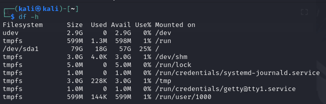
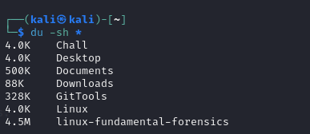
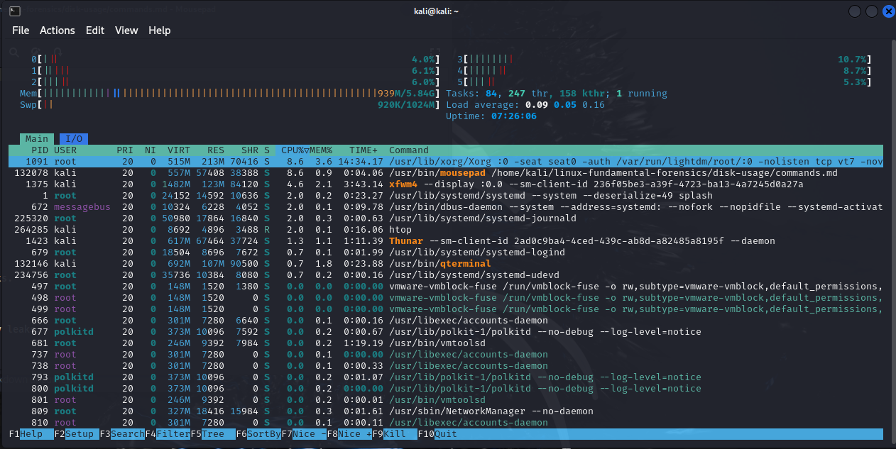
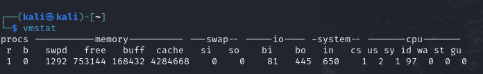
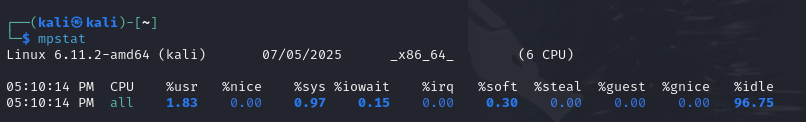
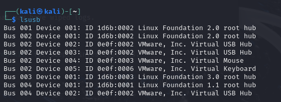
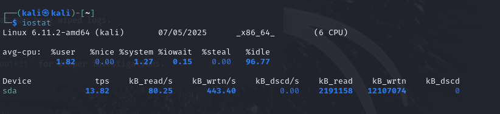
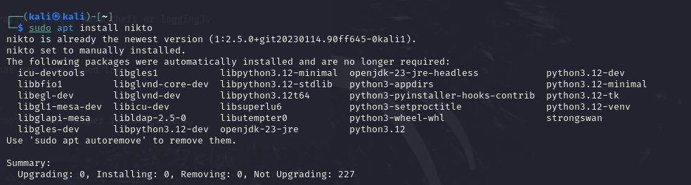

## 💾 Disk Usage & System Monitoring

1. `df -h`  
   **Disk space usage (human readable)**  
   🧠 Forensics: Spot full partitions.  

   📸 **Example:**  
   

2. `du -sh *`  
   **Folder-wise disk usage summary**  
   🧠 Forensics: Identify large folders.  

   📸 **Example:**  
   

3. `htop`  
   **Interactive process viewer**  
   🧠 Forensics: Identify rogue processes.  

   📸 **Example:**  
   

4. `btop`  
   **Modern resource monitor**  
   🧠 Forensics: View beautiful system stats.  

   📸 **Example:**  
   

5. `vmstat`  
   **System memory and performance stats**  
   🧠 Forensics: Spot heavy usage or memory leaks.  

   📸 **Example:**  
   

6. `mpstat`  
   **CPU usage statistics**  
   🧠 Forensics: Investigate abnormal CPU loads.  

   📸 **Example:**  
   

7. `lsusb`  
   **List connected USB devices**  
   🧠 Forensics: Check if a USB was used.  

   📸 **Example:**  
   

8. `iostat`  
   **CPU and I/O device statistics**  
   🧠 Forensics: Find processes doing heavy disk read/write operations (e.g., data theft or logging).  

   📸 **Example:**  
   

9. `uptime`  
   **Show system uptime and load average**  
   🧠 Forensics: Determine system stability or recent reboots that may have wiped logs.  

   📸 **Example:**  
   

10. `apt install toolname`  
   **Install forensic/monitoring tools on Debian-based systems**  
   🧠 Forensics: Add tools like `sleuthkit`, `autopsy`, or `chkrootkit` for deeper investigations.  

   	📸 **Example:**  
   	

