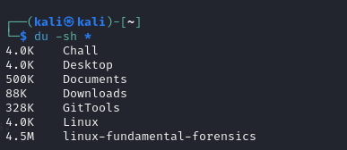
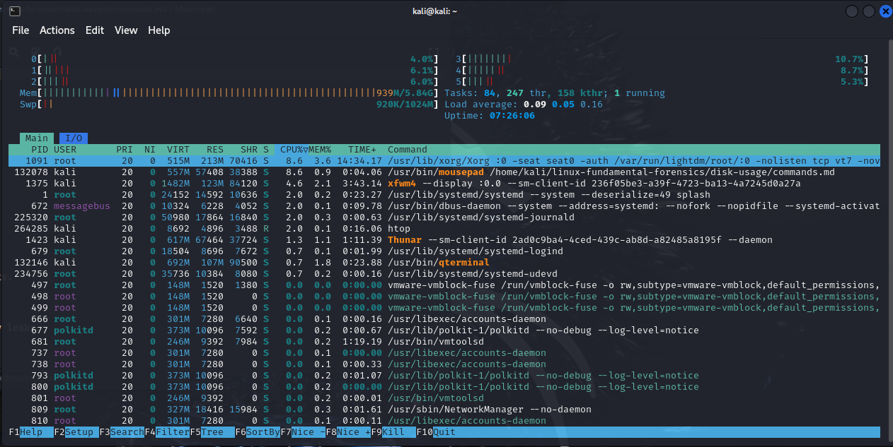
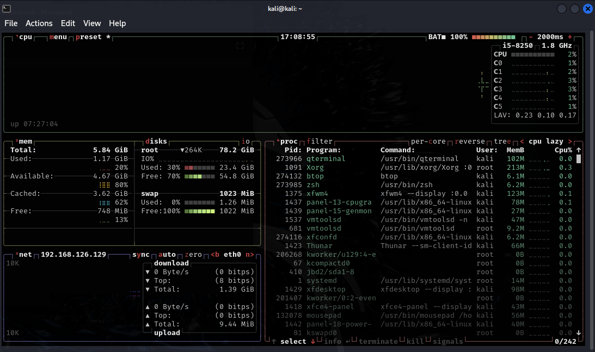
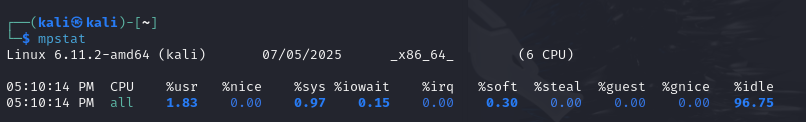
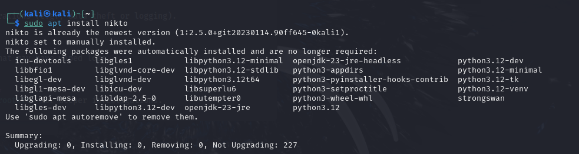

# 💾 Disk Usage & System Monitoring

📠This section focuses on monitoring system performance, disk usage, and identifying anomalies during forensic investigations.

1. `df -h`  
   **Disk space usage (human readable)**  
   🧠 Forensics: Spot full partitions that may be manipulated or filled to cause denial of service.  
   📸 Example: 

2. `du -sh *`  
   **Folder-wise disk usage summary**  
   🧠 Forensics: Identify large folders that may contain hidden payloads or data dumps.  
   📸 Example: 

3. `htop`  
   **Interactive process viewer**  
   🧠 Forensics: Detect suspicious running processes or resource hogs.  
   📸 Example: 

4. `btop`  
   **Modern terminal resource monitor**  
   🧠 Forensics: Graphically observe CPU, RAM, and disk behavior in real-time.  
   📸 Example: 

5. `vmstat`  
   **Report virtual memory statistics**  
   🧠 Forensics: Monitor memory, process, and CPU usage to detect spikes or abnormal behavior.  
   📸 Example: 

6. `mpstat`  
   **CPU usage statistics**  
   🧠 Forensics: Detect if any specific core is overloaded (indicating malware or miners).  
   📸 Example: 

7. `lsusb`  
   **List connected USB devices**  
   🧠 Forensics: Check for unauthorized USB device usage that might indicate data exfiltration.  
   📸 Example: 

8. `iostat`  
   **CPU and I/O device statistics**  
   🧠 Forensics: Find processes doing heavy disk read/write operations (e.g., data theft or logging).  
   📸 Example: 

9. `uptime`  
   **Show system uptime and load average**  
   🧠 Forensics: Determine system stability or recent reboots that may have wiped logs.  
   📸 Example: 

10. `apt install toolname`  
   **Install forensic/monitoring tools on Debian-based systems**  
   🧠 Forensics: Add tools like `sleuthkit`, `autopsy`, or `chkrootkit` for deeper investigations.  
   📸 Example: 

