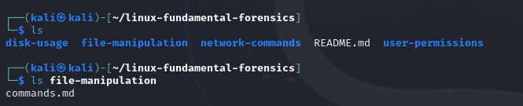
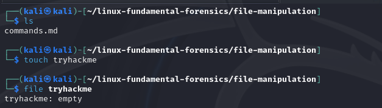
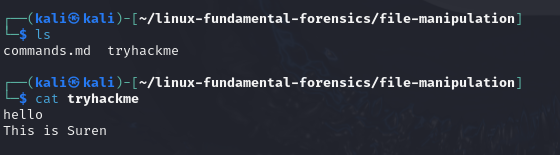
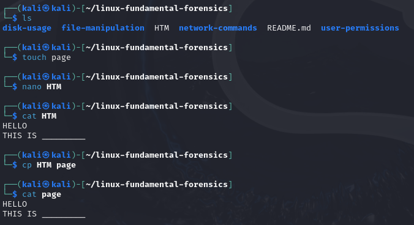
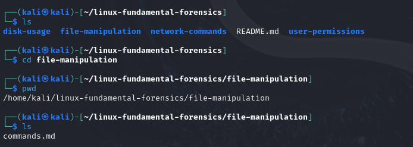
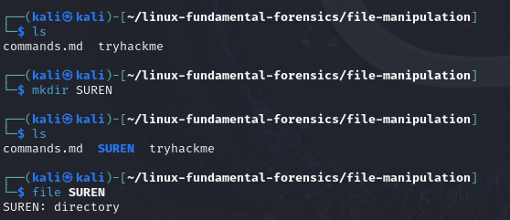
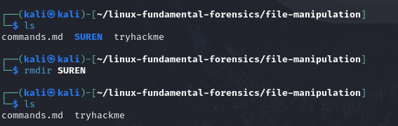
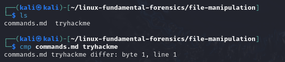
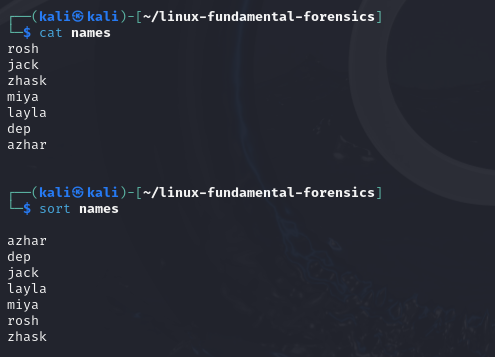
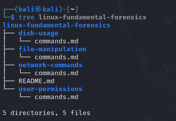

# 🗃 File Manipulation Commands

1. `ls`  
   **List directory contents**  
   📂 Forensics: Detect hidden files or abnormal names.  
   📸 Example:  
   

2. `touch file.txt`  
   **Create an empty file or update a file's timestamp**  
   📂 Forensics: Timestamp manipulation or dummy file creation.  
   📸 Example:  
   

3. `cat file.txt`  
   **Display the contents of a file**  
   📂 Forensics: Read logs, configs, or evidence.  
   📸 Example:  
   

4. `cp file1.txt file2.txt`  
   **Copy files and directories**  
   📂 Forensics: Duplicate evidence for analysis without modifying originals.  
   📸 Example:  
   

5. `cd foldername/`  
   **Change the current working directory**  
   📂 Forensics: Navigate quickly through file systems and evidence folders to inspect their contents.  

   📸 Example:  
   

6. `mkdir myfolder`  
   **Create a new directory**  
   📂 Forensics: For organizing forensic artifacts.  
   📸 Example:  
   

7. `rmdir emptydir`  
   **Remove an empty directory**  
   📂 Forensics: Clean up empty/unnecessary folders.  
   📸 Example:  
   

8. `cmp file1 file2`  
   **Compare two files byte-by-byte**  
   📂 Forensics: Spot unauthorized tampering.  
   📸 Example:  
   

9. `sort file.txt`  
   **Sort lines in a file**  
   📂 Forensics: Organize log entries or events.  
   📸 Example:  
   

10. `tree`  
   **Display directory structure in a tree-like format**  
   📂 Forensics: Quickly visualize nested folders or hidden directories.  
   📸 Example:  
   
