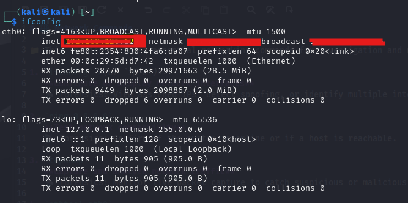
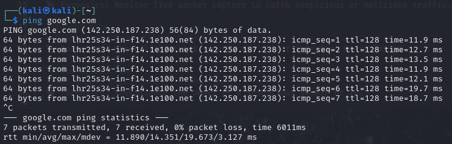
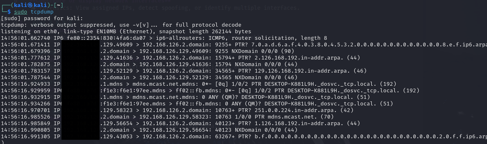
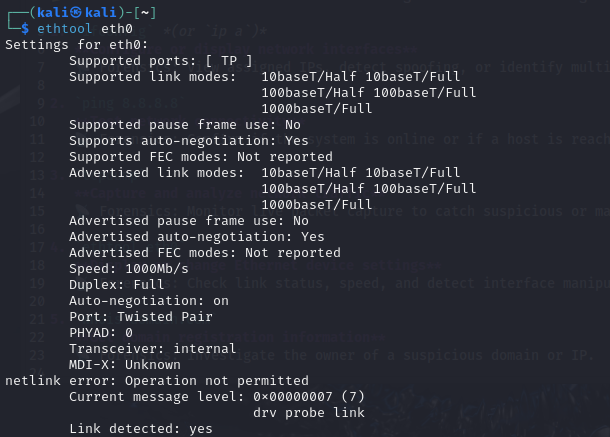
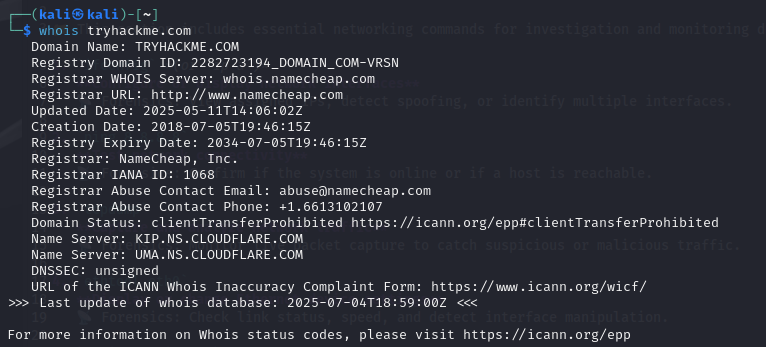
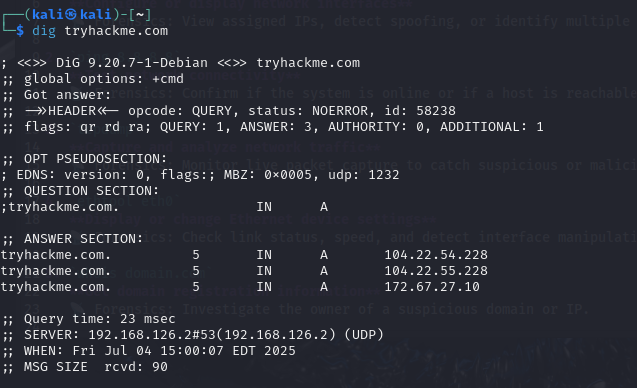
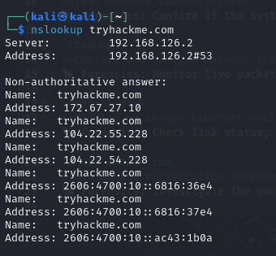
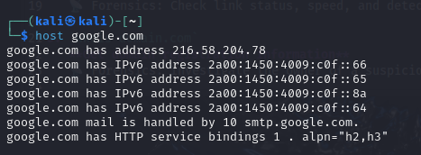
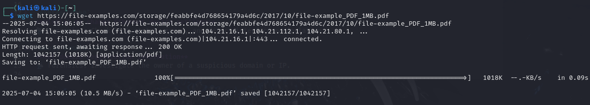
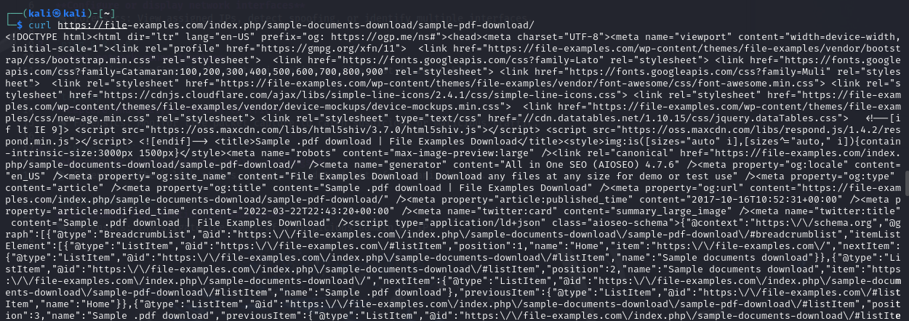

# 🌐 Network Commands

📁 This section includes essential networking commands for investigation and monitoring during forensic analysis.

1. `ifconfig` *(or `ip a`)*  
   **Configure or display network interfaces**  
   📡 Forensics: View assigned IPs, detect spoofing, or identify multiple interfaces.  
   
   📸 Example:  
   

2. `ping 8.8.8.8`  
   **Test network connectivity**  
   📡 Forensics: Confirm if the system is online or if a host is reachable.  
   
   📸 Example:  
   

3. `tcpdump`  
   **Capture and analyze network traffic**  
   📡 Forensics: Monitor live packet capture to catch suspicious or malicious traffic.  
   
   📸 Example:  
   

4. `ethtool eth0`  
   **Display or change Ethernet device settings**  
   📡 Forensics: Check link status, speed, and detect interface manipulation.  
   
   📸 Example:  
   

5. `whois domain.com`  
   **Get domain registration information**  
   📡 Forensics: Investigate the owner of a suspicious domain or IP.  
   
   📸 Example:  
   

6. `dig domain.com` *(or `dig -x IP` for reverse lookup)*  
   **DNS lookup / Reverse DNS lookup**  
   📡 Forensics: Identify domain records or trace IP back to host.  
   
   📸 Example:  
   

7. `nslookup domain.com`  
   **Query Internet name servers**  
   📡 Forensics: Inspect DNS records and mail servers.  
   
   📸 Example:  
   

8. `host domain.com`  
   **Resolve a domain to an IP or vice versa**  
   📡 Forensics: Quickly check DNS mapping — often used during recon.  
   
   📸 Example:  
   

9. `wget http://url`  
   **Download files from the internet**  
   📡 Forensics: Retrieve remote logs, binaries, or artifacts from a suspect server.  
   
   📸 Example:  
   

10. `curl https://url.com`  
   **Transfer data from/to a server using HTTP/HTTPS**  
   📡 Forensics: Interact with web APIs, simulate browser requests, or verify C2 communication. 
    
   	📸 Example:  
   	
