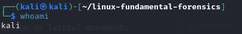
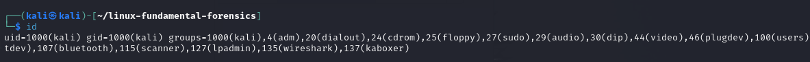
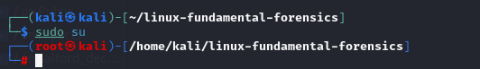
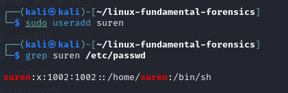
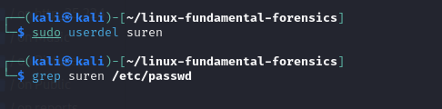
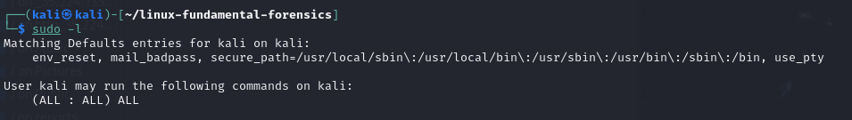
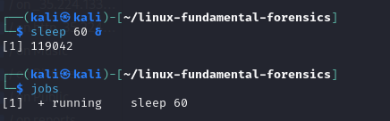
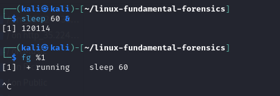
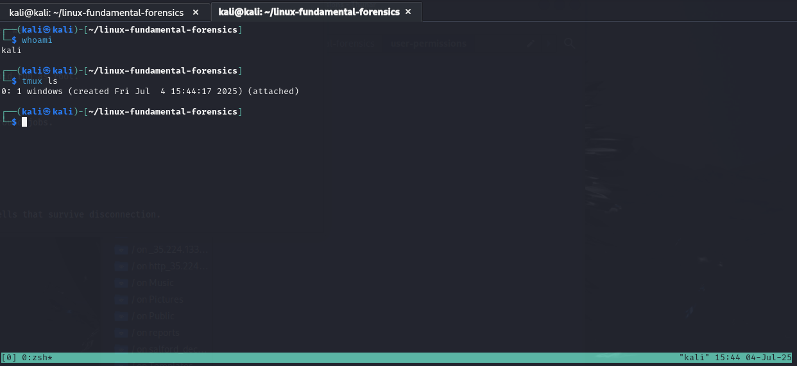

# 👥 User Permissions & Identity

📁 This section covers commands for managing users, viewing login history, checking privileges, and investigating user-level persistence or manipulation.

1. `whoami`  
   **Print the current username**  
   🔐 Forensics: Verify which user is executing commands, especially in post-exploitation or lateral movement.  
   
   📸 Example:  
   

2. `id`  
   **Show user and group IDs**  
   🔐 Forensics: Check if the user belongs to elevated groups like `sudo` or `wheel`.  
   
   📸 Example:  
   

3. `su username`  
   **Switch to another user (usually root)**  
   🔐 Forensics: Investigate unauthorized privilege escalation or lateral movement between accounts.  
   
   📸 Example:  
   

4. `last`  
   **Display recent login history**  
   🔐 Forensics: Track brute force attempts, backdoor logins, or suspicious activity. 
    
   📸 Example:  
   

5. `sudo useradd newuser`  
   **Create a new user account**  
   🔐 Forensics: Check if rogue users were created to maintain persistence.  
   
   📸 Example:  
   

6. `sudo userdel username`  
   **Delete a user account**  
   🔐 Forensics: See if traces of a forensic account or user were removed.  
   
   📸 Example:  
   

7. `sudo -l`  
   **List allowed sudo privileges for the current user**  
   🔐 Forensics: Check what commands a compromised user could run as root.  
   
   📸 Example:  
   

8. `jobs`  
   **Show background or suspended jobs in the shell**  
   🔐 Forensics: Hidden processes could be parked in background jobs.  
   
   📸 Example:  
   

9. `fg %1`  
   **Bring a suspended job to the foreground**  
   🔐 Forensics: Resume and analyze suspicious jobs.  
   
   📸 Example:  
   

10. `tmux`  
   **Terminal multiplexer for persistent sessions**  
   🔐 Forensics: Used by attackers for stealthy, hidden shells that survive disconnection.  
   
   	📸 Example:  
   	
